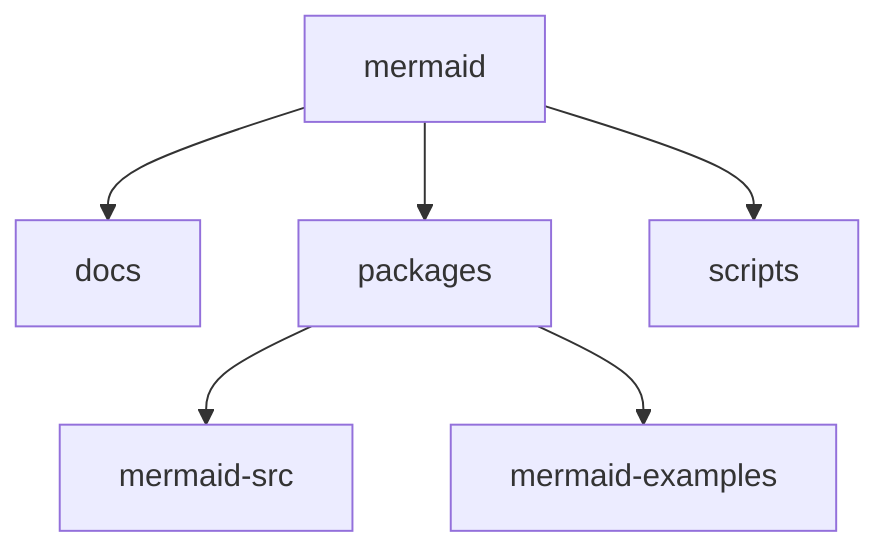
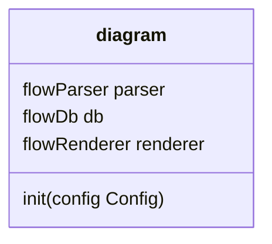
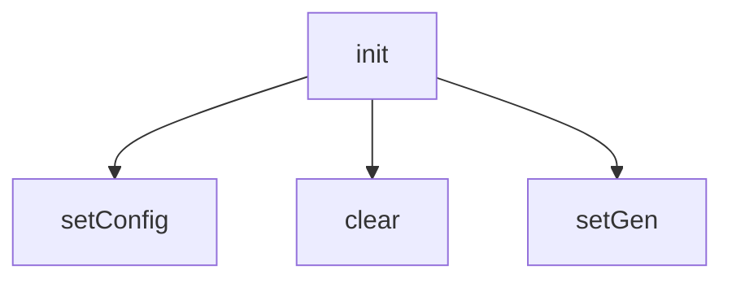
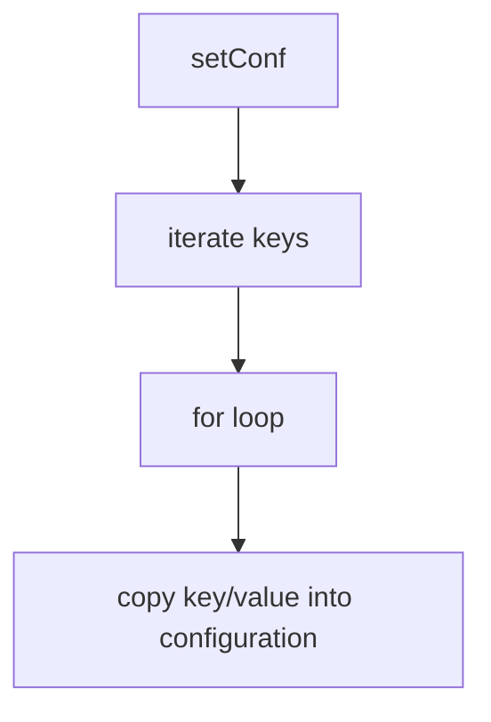
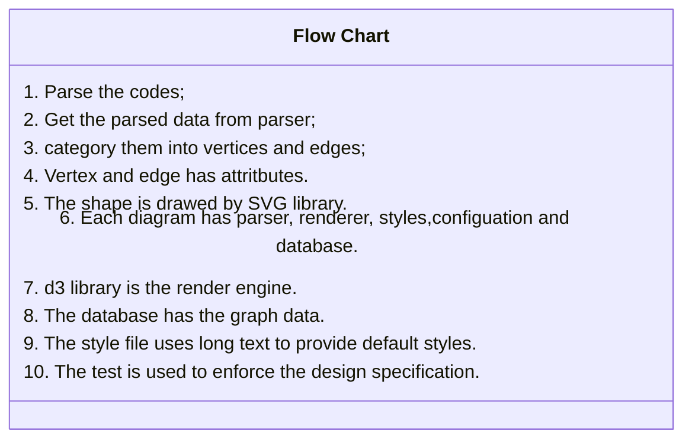
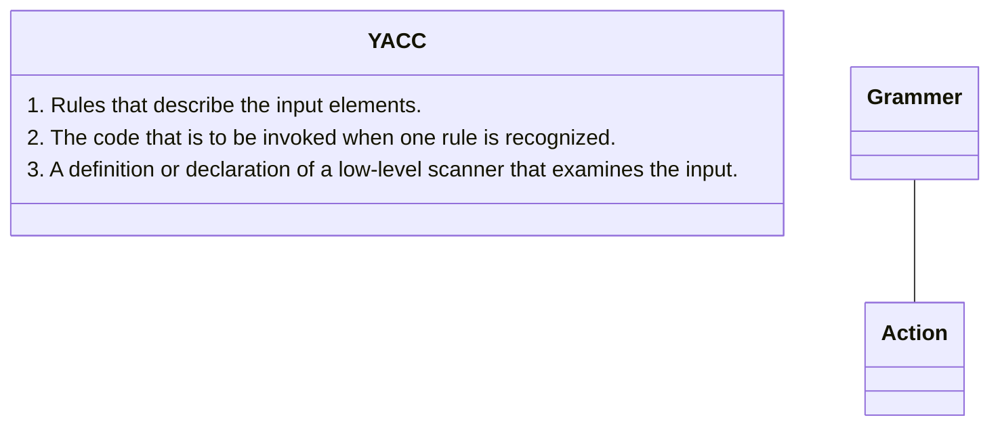

# Code Overview

## Root Directory

```dot
digraph {
  mermaid -> { docs packages scripts }
  packages -> { mermaid-src mermaid-examples }
}
```



## Packages Directory

### file `flowDiagram.ts`





### Flow Chart

#### file `flowRenderer.js`




