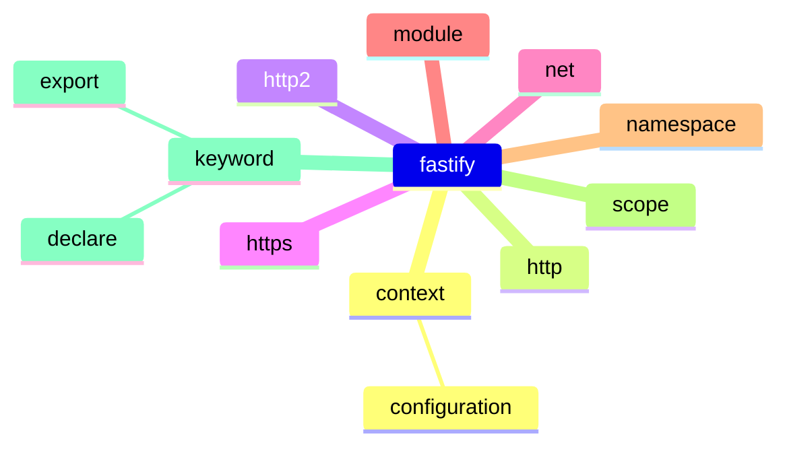
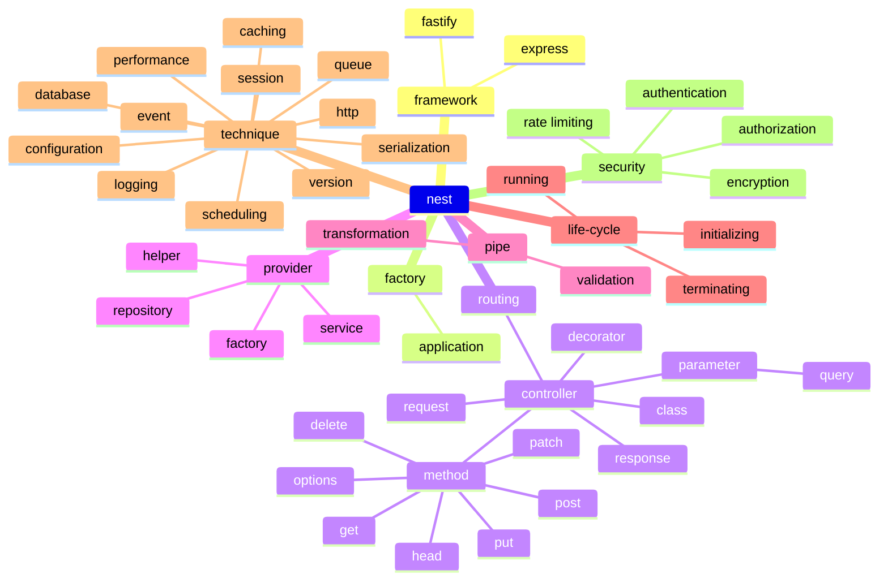

# Guide

## fastify

```mermaid
mindmap
    fastify
        context
            configuration
        http
        http2
        https
        net
        module
        namespace
        scope
        keyword
            declare
            export
```            

## nest

```mermaid
mindmap
    nest
        framework
            express
            fastify
        factory
            application
        routing
            controller
                class
                decorator
                method
                    get
                    post
                    put
                    delete
                    patch
                    options
                    head
                parameter
                    query
                request
                response
        provider
            service
            repository
            factory
            helper
        pipe
            transformation
            validation
        life-cycle
            initializing
            running
            terminating
        technique
            configuration
            database
            caching
            serialization
            version
            scheduling
            queue
            logging
            event
            http
            session
            performance
        security
            authentication
            authorization
            encryption
            rate limiting
```
